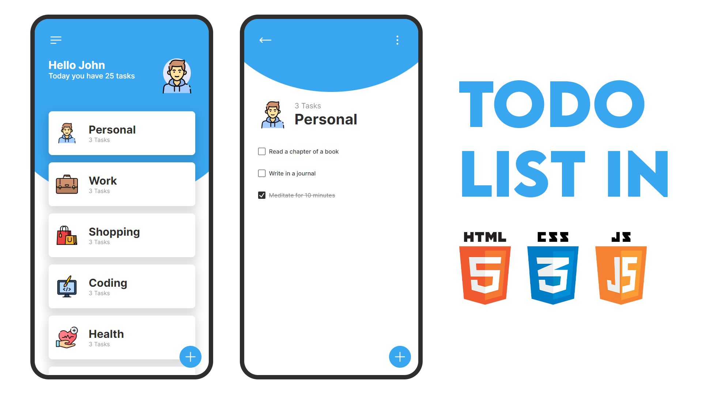

# 🌟 Habits Tracker App

A React Native + Expo based Habits Tracker App designed to help users organize tasks into categories, track progress, and stay motivated with timely notifications.  
The app features a beautiful splash screen, typing animations, and WebView integration for an extended experience.

---

<p align="center">
  
</p>

---

## 💻 My Favorite Tools & Technologies

<div align="center">
  <table>
    <tr>
      <td align="center" width="96">
        
        <br>React Native
      </td>
      <td align="center" width="96">
        
        <br>JavaScript
      </td>
      <td align="center" width="96">
        
        <br>TypeScript
      </td>
      <td align="center" width="96">
        
        <br>Android
      </td>
      <td align="center" width="96">
        
        <br>Git
      </td>
      <td align="center" width="96">
        
        <br>GitHub
      </td>
      <td align="center" width="96">
        
        <br>Linux
      </td>
      <td align="center" width="96">
        
        <br>VS Code
      </td>
    </tr>
  </table>
</div>

---

## 📂 Project Structure

```
.
├── app
│   ├── _layout.tsx        # Navigation stack & status bar setup
│   ├── index.tsx          # Welcome screen with typing effect & WebView
│   └── temp/              # Legacy vanilla JS/HTML logic for categories & tasks
├── assets
│   ├── images/            # Icons and splash screen images
│   ├── fonts/             # Custom fonts
├── android                # Native Android project files (for building APK)
├── package.json           # Dependencies & scripts
├── app.json               # Expo configuration (icons, splash screen, etc.)
└── tsconfig.json          # TypeScript configuration
```

---

## ✨ Features

### 👋 Welcome Screen
- Displays app logo, name, and a typing effect with motivational quotes.
- A "Continue" button opens a WebView with an external site.

### 🔔 Push Notifications
- Uses Expo Notifications to schedule motivational reminders.
- **Development:** Sends notifications every minute (up to 5 times).
- **Production:** Daily reminders to encourage habit tracking.

### 🌐 WebView Integration
- After the welcome screen, loads an external web app via WebView.

### 📌 Category & Task Logic (Legacy: `app/temp/`)
- Predefined categories: Personal, Work, Shopping, Coding, etc.
- Users can add, delete, or complete tasks (stored in localStorage in the vanilla JS version).

---

## 🚀 How to Run

1. **Install dependencies**
   ```bash
   npm install
   ```
2. **Start the app**
   ```bash
   npx expo start
   ```
   You can run it on Android Emulator, iOS Simulator, Expo Go, or web.

---

## ⚙️ Customization

- **Categories & Tasks:** Modify `app/temp/` for default categories or add new ones.
- **Icons & Branding:** Replace files in `assets/images/`.
- **Notification Messages:** Update strings in `app/index.tsx`.

---

## 🛠 Tech Stack

- React Native
- Expo
- TypeScript
- Vanilla JS (legacy, in `app/temp/`)
- Kotlin (native Android files)

---

## 🤝 Contributing

Contributions are always welcome!

1. Fork the repository
2. Create a feature branch:
   ```bash
   git checkout -b feature/NewFeature
   ```
3. Commit your changes:
   ```bash
   git commit -m 'Add NewFeature'
   ```
4. Push to your branch:
   ```bash
   git push origin feature/NewFeature
   ```
5. Submit a Pull Request

---

## ⭐ Support

If you find this project helpful, please give it a star ⭐ on GitHub.  
It motivates
